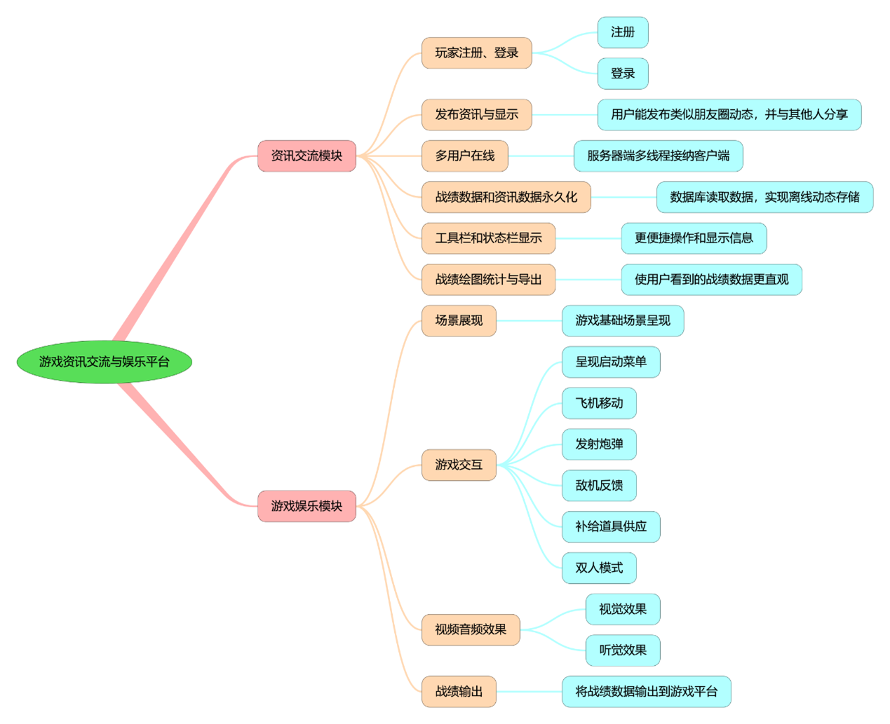

# GIEP

## Introduction
Game entertainment information platform, Java basics application, built-in aircraft battle mini-games and dynamic communication, battle results list and other consulting functions.

## Function module diagram

## Function implementation description

### 1 Information exchange module

#### 1.1 Player registration, login

Use swing to draw registration and login GUI, and at the same time get in touch with the server side of the platform to perform registration operation or perform login operation. When registering, the client will send the user information to the server and store it in the database. When logging in, the user's input information is verified to determine whether the user can log in. At the same time, the system is set to prevent users from repeatedly logging in.

#### 1.2 Publishing and displaying information

Swing is used to draw information cards and display user's avatar, ID, information content and other information. The information cards are stacked to form an information scrolling interface.

Users can view all information published by users in the system in chronological order, and all the results of each user sorted from highest to lowest.

Users can post information to the server and see what they have posted. You can also use the refresh button to see the new information posted by other players.

#### 1.3 Multi-User Online

The server side uses multi-threading technology to allow multiple users to be online at the same time and to share information and records with each other.

#### 1.4 Permanent battle result data and information data

JDBC is used to connect with MySQL database and make the performance data and information data persistent.

#### 1.5 Toolbar and status bar display

Use swing components to implement toolbar and status bar displays to provide a quick way to use various functions. Enhance the display.

#### 1.6 Battlemap statistics and export

The use of JFreechart to achieve the performance plotting function, the use of iText export performance plotting PDF function, the use of jxl export Excel performance data. Many export methods to make the performance data more intuitive, performance data can be stored.

### 2 Game Entertainment Module

#### 2.1 Scene presentation

Use the background map of the web resource to scroll the background of the airplane mini-game without interruption vertical displacement.

#### 2.2 Game interaction

Mainly use the keyboard listener to realize the game and human interaction. Using the paint method of the rewritten component in the use of draw to achieve dynamic refreshing and display of the game scene, image addition, to achieve game effects, while building enemy aircraft, our fighters, interactive operation, while providing additional props resupply.

#### 2.3 Video and audio effects

Realize rich video and audio effects in the scenes in the game.

#### 2.4 Battle Output

After the game is over, send the game performance to the server side and make it available for the platform client to read.

## User Manual

[用户使用手册](用户使用手册.pdf)

## Contribute

1. Fork this repository
2. Create a new Feat_xxx branch
3. Commit the code
4. Create a new Pull Request

