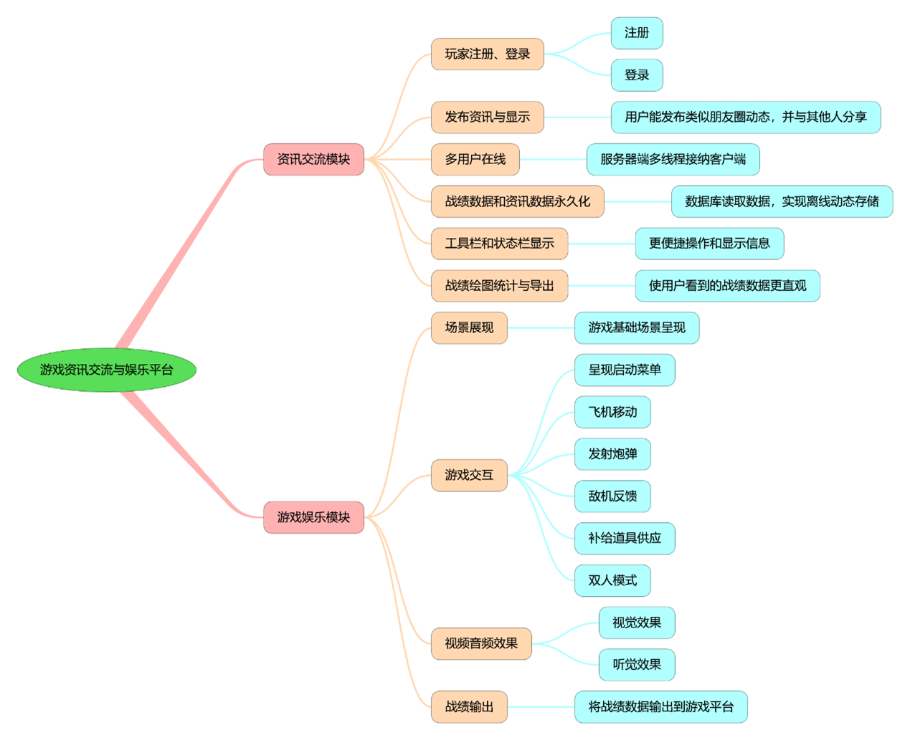

# GIEP

## 介绍
游戏娱乐资讯平台，Java基础知识应用，内置飞机大战小游戏及动态交流、战绩列表等咨询功能。

## 功能模块图

## 功能实现描述

### 1资讯交流模块

#### 1.1玩家注册、登录

利用swing绘制注册、登录GUI，同时与平台服务器端取得联系，进行注册操作或进行登录操作，注册时客户端将把用户信息发送到服务器，并将其存入数据库。登录时会核验用户输入信息，确定是否可以登录。同时，系统设定阻止用户的重复登录。

#### 1.2发布资讯与显示

利用swing绘制资讯卡片，并加以显示用户的头像、ID、资讯内容等信息。将资讯卡片堆叠形成资讯滚动界面。

用户可以按时间先后顺序查看系统中的用户发表的所有资讯，以及按战绩从高到低顺序排序的各个用户的所有战绩。

用户可以发表资讯到服务器端，并查看到自己发布出的资讯。也可以通过刷新按钮查看其他玩家新发出的资讯。

#### 1.3多用户在线

服务器端采用多线程技术，允许多用户同时在线，并互相分享资讯、战绩等信息。

#### 1.4战绩数据和资讯数据永久化

利用JDBC与MySQL数据库连接，并使战绩数据和资讯数据持久化。

#### 1.5工具栏和状态栏显示

利用swing组件实现工具栏和状态栏的显示，为各种功能提供快捷使用的方式。增强显示效果。

#### 1.6战绩绘图统计与导出

利用JFreechart实现战绩绘图功能，利用iText导出战绩绘图PDF功能，利用jxl导出Excel战绩数据。诸多导出方式使战绩数据更加直观、战绩数据得以储存。

### 2游戏娱乐模块

#### 2.1场景展现

利用网络资源的背景图无间断垂直位移滚动进行飞机小游戏背景显示。

#### 2.2游戏交互

主要利用键盘监听器，实现游戏与人的互动。利用重写组件的paint方法中利用draw实现游戏场景动态刷新和显示，图像添加，实现游戏效果，同时构建敌机、我方战机，交互运作，同时额外提供道具补给。

#### 2.3视频音频效果

在游戏里场景中实现丰富的视频、音频效果。

#### 2.4战绩输出

在游戏结束后，将游戏战绩发送到服务器端，并供平台客户端读取。

## 用户使用手册

[用户使用手册](用户使用手册.pdf)

## 参与贡献

1.  Fork 本仓库
2.  新建 Feat_xxx 分支
3.  提交代码
4.  新建 Pull Request

